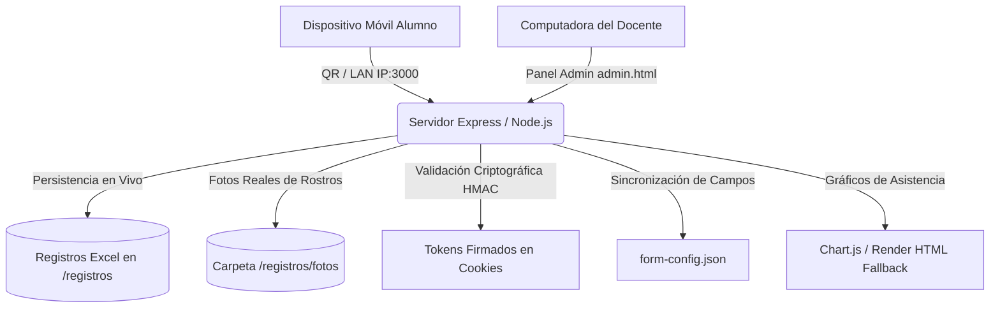

# 📘 Documentación Oficial y Completa de AulaInicial (v2.13)

## 📑 Resumen Ejecutivo (Executive Summary)

**AulaInicial** es una plataforma web portátil, autónoma y de cero configuración (*Zero-Config*) diseñada para la **gestión integral de asistencia, registro inicial de datos personales/de clase, identificación visual de alumnos y organización de grupos en aulas presenciales o virtuales**.

El sistema funciona de forma totalmente independiente sin requerir servidores de base de datos ni conexión obligatoria a Internet, operando desde unidades USB/Pendrives en cualquier equipo con Windows o Linux. Toda la información se persiste y sincroniza en hojas de cálculo de **Microsoft Excel (`.xlsx`)** ubicadas en la carpeta de trabajo del curso.

---

## 🌟 Características Principales y Funcionalidades

### 1. 🎓 Registro de Alumnos y Toma de Asistencia (Vista Alumno)
- **Acceso por Código QR Dinámico**: Los alumnos escanean el código QR proyectado en pantalla para acceder desde sus dispositivos móviles en la red local (LAN/Wi-Fi).
- **Asistencia Automática Inmediata por Cookie Firmada**:
  - Tras el primer registro, el sistema genera un **Token Criptográfico Firmado (HMAC-SHA256)** que se almacena en el navegador del teléfono del alumno.
  - En las siguientes clases, al escanear el QR, el sistema reconoce al alumno al instante y **marca su PRESENTE automáticamente** sin requerir volver a escribir sus datos o seleccionar su nombre.
- **Foto Real del Rostro Configurable (Protección de Menores y Privacidad)**:
  - **Campo Opcional y Desactivable por el Docente**: Para cumplir con regulaciones de privacidad y protección de menores, la solicitud de foto de rostro es 100% configurable. El docente puede activarla, hacerla obligatoria/opcional o **desactivarla por completo** desde la pestaña de configuración del formulario.
  - Si está activada, el alumno toma o sube una **foto real de su cara** desde la cámara táctil de su teléfono (`capture="user"`), almacenándose localmente en `registros/fotos/`.
- **Formulario Adaptable de Clase**:
  - **Datos Personales (👤)**: Email Privado, DNI/ID, Título Profesional / Especialidad, Nivel Tecnológico, Grupo, Teléfono y Foto de Rostro (Configurable).
  - **Datos de Clase (📚)**: Preguntas o actividades puntuales solicitadas para una jornada. Si hay preguntas activas, se desplegarán para responderlas, pero el **PRESENTE** ya queda asentado desde el primer instante en que se escanea el QR.

### 2. 👨‍🏫 Panel de Control del Docente (Vista Administrador)
- **Navegación Simplificada y Rápida**:
  - **🎓 Manejo de Alumnos**: Monitor con tarjetas de estado de asistencia (*Presente*, *Ausente*, *Pendiente*), fotos reales de rostro (si están habilitadas) y alta/edición manual de alumnos.
  - **⚙️ Formularios**: Configuración dinámica de campos (activación/desactivación de Email, DNI, Título, Grupo, Teléfono y **Foto de Rostro**), categorización (**Personal** vs **Clase**), botón **`🧹 Desmarcar Todas las Tildes`** y editor interactivo de opciones desplegables.
  - **📲 Lista y QR**: Código QR proyectable en alta resolución con la IP de la red local.
  - **📊 Estadísticas**: Gráficos interactivos de distribución por Título Profesional y Nivel Tecnológico.
  - **👥 Grupos**: Gestor de grupos con edición de integrantes.
  - **📥 Exportar**: Descarga de reportes en Excel (`.xlsx`), Word (`.docx`) y Texto (`.txt`).
- **Resplandor Neón de Presente (`Glowing Border`)**:
  - Si la función de fotos está activa, cada tarjeta de alumno exhibe la foto real de su rostro.
  - Cuando un alumno da su **PRESENTE**, su foto se **ilumina automáticamente con un marco verde neón fluorescente brillante** (`box-shadow: 0 0 12px #4ade80`), permitiendo al docente asociar la cara del alumno con su nombre en un solo segundo.
  - Para los alumnos pendientes o ausentes, la foto se muestra en tonos neutros o escala de grises. Si el campo de foto está desactivado por el docente, se muestran las iniciales del alumno en una insignia limpia.
- **Moderación y Control Docente de Fotos (`🗑️ Foto`)**:
  - Si un alumno subió una foto que no corresponde a su rostro (mascota, objeto o caricatura), el docente cuenta con el botón **`🗑️ Foto`** en la lista o ficha del alumno.
  - Al presionar el botón, la foto se elimina en el servidor. En el siguiente escaneo del QR, el sistema del alumno detectará la falta de foto y le exigirá subir una foto clara de su rostro.
- **Limpieza Rápida de Casillas (`🧹 Desmarcar Todas las Tildes`)**:
  Permite desmarcar todas las casillas activas con un solo clic tras finalizar una clase, guardando automáticamente los cambios sin borrar la definición de los campos para su reutilización.

### 3. 📂 Gestión de Archivos y Registros Operativos (`registros/`)
- Inicialización autónoma: Al activar un curso, el sistema crea o sincroniza su copia de trabajo en la carpeta `registros/` a partir de la plantilla original en `cursos/`.
- Almacenamiento local de avatares en `registros/fotos/`.
- Tolerancia en nombres de archivo y grupos (insensibilidad a tildes, espacios o prefijos tipo *"GRUPO A"* vs *"A"*).
- Notificación amigable ante archivos bloqueados en Windows (`EBUSY`) solicitando cerrar Excel si el archivo está en uso.

---

## 🏗️ Arquitectura Técnica y Estructura



### Estructura de Directorios del Proyecto:

```
AulaInicial/
├── form-config.json            # Configuración persistente de campos del formulario
├── bin/                        # Ejecutables autónomos compilados (AulaInicial.exe y AulaInicial-linux)
├── cursos/                     # Plantillas iniciales de cursos (.xlsx)
├── registros/                  # Archivos operativos de trabajo y asistencias
│   └── fotos/                  # Almacenamiento local de fotos reales de rostro de alumnos
├── Docs/
│   ├── DOCUMENTACION.md        # Documentación completa y detallada oficial
│   └── Imagenes/               # Capturas e ilustraciones descriptivas del sistema
├── Presentación/               # Guiones, presentaciones y material multimedia
├── admin.html                  # Interfaz del Panel del Docente
├── admin.js                    # Lógica cliente del Panel y Gráficos
├── index.html                  # Formulario de Registro para Alumnos y Auto-Presente
├── index.js                    # Lógica cliente del Formulario, Tokens y Fotos
├── server.js                   # Servidor Express, API REST, HMAC y manejo de Excel
├── style.css                   # Sistema de diseño Glassmorphism y Resplandor Neón
├── start.bat                   # Ejecutor portátil para Windows
└── start.sh                    # Ejecutor portátil para Linux
```

---

## 📊 Endpoints de la API REST (`server.js`)

| Método | Endpoint | Descripción |
| :--- | :--- | :--- |
| `GET` | `/api/cursos` | Retorna la lista de planillas disponibles en `cursos/`. |
| `GET` | `/api/active-course` | Obtiene el curso activo seleccionado. |
| `POST` | `/api/active-course` | Establece el curso activo de la sesión. |
| `GET` | `/api/alumnos?curso=...` | Retorna la nómina, fotoUrl y asistencias del curso activo. |
| `POST` | `/api/registro` | Registra datos, procesa foto real del rostro y marca PRESENTE en Excel. |
| `POST` | `/api/auto-presente` | Valida el token firmado criptográficamente y asienta el PRESENTE instantáneo. |
| `POST` | `/api/borrar-foto-alumno` | Elimina la foto real del rostro de un alumno (moderación docente). |
| `POST` | `/api/agregar-alumno` | Endpoint alias de alta manual de alumnos desde el panel docente. |
| `GET` | `/api/form-config` | Obtiene la configuración de campos del formulario. |
| `POST` | `/api/form-config` | Guarda la configuración de campos y opciones de desplegables. |
| `GET` | `/api/stats?curso=...` | Calcula las métricas de títulos y nivel tecnológico. |
| `GET` | `/api/export/excel?curso=...` | Exporta el reporte estructurado en Excel (`.xlsx`). |
| `GET` | `/api/export/word?curso=...` | Exporta el informe preparado para Microsoft Word (`.docx`). |
| `GET` | `/api/export/texto?curso=...` | Exporta el resumen ordenado en archivo de texto (`.txt`). |
| `STATIC`| `/registros/fotos/...` | Servido estático seguro de fotos de rostros de alumnos. |
